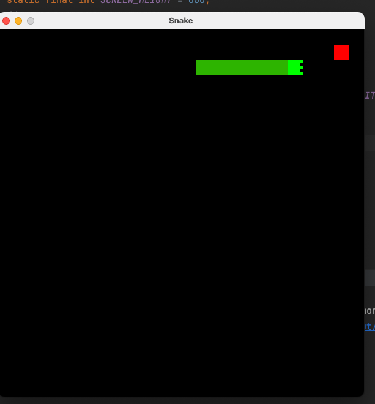

# Snake Game



## Overview

This is a simple Snake game implemented in Java using the Swing framework. The game features a classic Snake that moves around a grid, eats apples to grow, and must avoid collisions with its own body and the game borders.

## Features

- **Grid-based Movement:** Navigate the snake through a grid-based environment.
- **Apple Eating:** Grow the snake by eating apples that appear on the screen.
- **Collision Detection:** Avoid collisions with the snake's own body and the game borders.
- **Responsive Controls:** Control the snake's direction using arrow keys.

## How to Play

1. Clone the repository to your local machine.
   ```bash
   git clone https://github.com/samjsolomon/Snake.git
